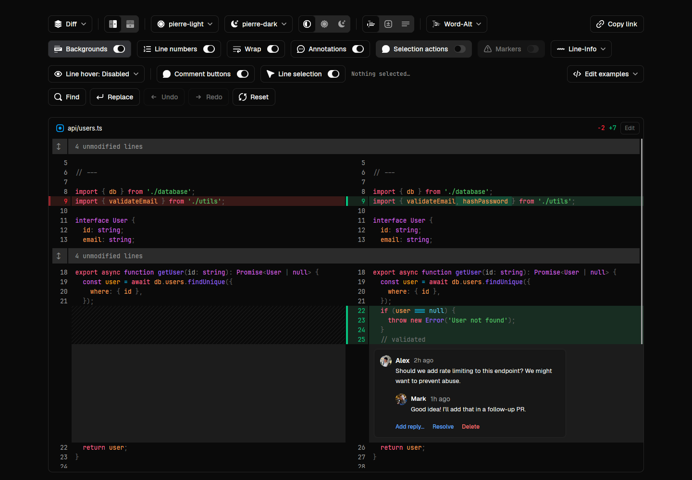

# Pierre Native

A diff viewer and editor for GPUI and GPUiX. The desktop and browser playgrounds
use the same editor components and Rust viewport.

[Try the compiled playground](https://pierre-native-preview.fluo-erwin.workers.dev/playground/)
or [open the website](https://pierre-native-preview.fluo-erwin.workers.dev/).

This is an independent port of [Pierre Diffs](https://diffs.com), based on
`@pierre/diffs` 1.4.3. It is not an official Pierre product.



The library supports file views, split and unified diffs, virtualized collections,
editing, undo and redo, find and replace, comments, markers, remote carets,
merge conflicts, and streamed files. The playground reproduces the Pierre
controls and adds independent line selection and comment controls.

## Build and run

Use Bun and Rust. The packaged desktop app currently targets macOS arm64.
Install Xcode Command Line Tools for native builds. Browser builds also need
nightly Rust with `rust-src` and wasm-bindgen CLI 0.2.127.

```sh
git clone https://github.com/erwinkn/pierre-native.git
cd pierre-native
bun install --frozen-lockfile

# Build the native runtime, then open the desktop playground.
bun run build:native
bun run dev
```

The Rust toolchain file pins the native compiler. Cargo pins GPUiX and its GPUI
source. The JavaScript dependencies use the shared GPUiX fork's release archives.
No local Cherry checkout or source patch is required.

Build a macOS application bundle with:

```sh
bun run build:desktop
open "dist/Pierre Native.app"
```

The bundle embeds Bun, the native composition, the application worker, fonts,
and playground assets. Local builds use ad-hoc signing. The app uses GPUI's
native event loop and an explicit Bun worker for React.

## Browser playground

```sh
rustup toolchain install nightly-2026-09-16 --component rust-src --target wasm32-unknown-unknown
cargo install wasm-bindgen-cli --version 0.2.127 --locked
bun run build:wasm
bun run build:web
bun run web
```

Open the address printed by the local server. The page contains the actual GPUI
renderer compiled to WebAssembly. It tries WebGPU, then falls back to WebGL2.
The static website is in `dist/site`.

The [GitHub workflow](.github/workflows/playground.yml) builds and verifies the
app and website. Cloudflare deploys its generated `pages` branch. See the
[deployment setup](docs/deployment.md).

The server supplies the cross-origin isolation headers required by shared
WebAssembly memory. Cloudflare Pages uses the generated `_headers` file.
Do not open the HTML directly as a local file.

All five playground views support editing. Click **Edit** in a file header to
start. **Cancel** restores the prior contents; **Save** accepts the in-memory
change. Demo edits do not write to disk. The selected-code panel can collect and
copy snippets. A host application supplies its own chat provider. The tab
prediction demo is omitted.

## Use the library

The TypeScript package is `@erwinkn/pierre-native`. It exports `File`, `FileDiff`,
`CodeView`, `MultiFileDiff`, and `Editor`. It uses `@gpuix/react` as a peer.
The package ships source and assets for Bun; it does not select or embed a native
runtime in a consuming application.

```tsx
import { DiffProvider, File } from "@erwinkn/pierre-native";

<DiffProvider>
  <File
    file={{ name: "hello.ts", contents: 'export const greeting = "Hello";\n' }}
    edit
    height="100%"
    onEditChange={(file) => saveInApplicationState(file)}
  />
</DiffProvider>;
```

The host must link the Pierre viewport into its selected GPUiX composition.
Configure that binding before importing React or application code. Both native
host and worker must load the same composition. Native hosts also provide a
clipboard adapter. See the [API guide](docs/api.md),
[architecture](docs/architecture.md), and the working entries in `examples`.

Rust applications can use the ordinary GPUI `Viewport` directly from
[`pierre-native-view`](crates/pierre-view). The viewport has no React renderer
dependency by default. The `legacy` feature supplies the adapter used by the
current native and browser demos.

The separate [`pierre-react-runtime`](crates/pierre-react) demonstrates the new
asynchronous bridge. It is opt-in and currently supports macOS/Bun only. The
playground keeps the browser-capable legacy adapter. Build the two compositions
separately to avoid Cargo feature unification.

## Verification

After building both runtimes:

```sh
bun run typecheck
bun run test:source
bun test tests vendor/pierre/test
bun run test:native
bun run test:application

# With the website server running and agent-browser installed:
bun run test:browser
bun run test:webgl
```

The source suite has 636 tests, including the original Pierre algorithms and
recorded browser editing transcripts. Native suites exercise real GPUI input,
IME, scrolling, geometry, pixels, comments, and collection edits. Browser tests
exercise the compiled viewport on both backends. Application tests also run a
relocated compiled executable. See [verification details](docs/verification.md).

## Source and license

Apache-2.0. See [LICENSE](LICENSE) and [NOTICE](NOTICE). Original algorithms and
their source hashes are in `vendor/pierre`. Playground samples, fonts, and icons
have source manifests and their original licenses. The upstream revision is
`c5b1e58203fa5c59dd99353cbcac09ee653a24f6`.
