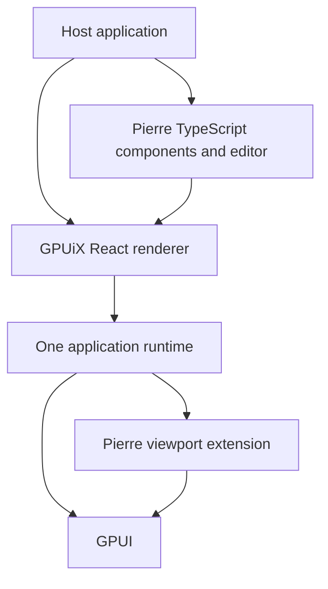

# Architecture

Pierre Native has two library layers. The TypeScript package owns the document,
editing commands, diff layout, syntax tokens, and React components. The Rust
crate `pierre-native-view` owns the GPUI viewport. It paints visible rows and
handles native input, selection geometry, and scrolling.

The viewport is an ordinary GPUI `Render` view. Its optional legacy adapter has
the native element name `pierre-viewport`. GPUiX has no dependency on Pierre
or Cherry. The document model and undo history stay in TypeScript. The native
viewport owns selection, IME preview, layout, scrolling, and paint.



## Native runtime

A composition crate links GPUiX and the extensions that an application uses.
The standalone demo links only the Pierre extension. Cherry can link Pierre
and its other extensions into its own runtime. There is one GPUI runtime in
each process.

The Rust composition calls `pierre_native_view::register()` before it creates
a renderer. Registration validates the extension API version and element name.
Applications configure their binding module through `@gpuix/native/runtime`
before they import `@gpuix/react`. An application with a worker must configure
the same composition in the native host and application worker.

The library never loads a `.node` file or a WebAssembly module. It uses
`@gpuix/react` as a peer dependency. The application owns runtime startup.
The extension API is a Rust compile contract, not a dynamic binary ABI. Compile
the core and all extensions against the same pinned GPUiX and GPUI revisions.

The default app uses `runApplication` on the main thread and
`attachApplication` in its explicit worker. The same compiled binding is selected
in both entry points. This keeps AppKit's event loop native.

The new asynchronous bridge adapter is separate and opt-in. It shares the same
viewport implementation but does not yet have a browser application driver.
The current playground therefore uses the legacy adapter on all targets.

## Host integration

`DiffProvider` supplies the UI theme and an optional `renderPart` callback.
The callback receives every named component part before render. A host can
decorate or replace the part through its own plugin registry. Call
`renderDefaultPart(data)` to render the normal part and keep its child context.

The provider does not own application state, plugin resolution, or chat state.
The standalone demo uses its default renderer. Cherry can supply its existing
part registry through the callback.

Native hosts call `configureClipboard` with their platform clipboard functions.
The browser uses the Clipboard API. A controller can also receive its own
clipboard through `NativeEditorOptions`.

## Browser build

The browser runs the same editor and Rust viewport. GPUiX initializes its
compiled WebAssembly renderer and tries WebGPU first. If no adapter is usable,
GPUI uses WebGL2. The editor is drawn in a canvas. The runtime uses its browser
input bridge for keyboard input and IME.

Shared WebAssembly memory needs cross-origin isolation. Both the page and the
playground frame must receive these response headers:

```text
Cross-Origin-Opener-Policy: same-origin
Cross-Origin-Embedder-Policy: require-corp
```

The static output includes `_headers` for Cloudflare Pages. Fonts and images
are local assets. Font registration and text measurement run before the first
editor layout. The demo uses data URLs for avatar images so GPUI can load them
on both native and browser targets.

## Pierre source

`vendor/pierre` contains the original patch parser, diff algorithms, piece
table, selection transforms, edit history, and command helpers. The source
manifests record the exact upstream revision and hashes. The native controller
adapts browser focus, scroll, and input operations to GPUI.

`@pierre/diffs` supplies upstream TypeScript declarations. Its browser renderer
is not called by this implementation. Shiki supplies syntax tokens. GPUI shapes
and measures the displayed text.
